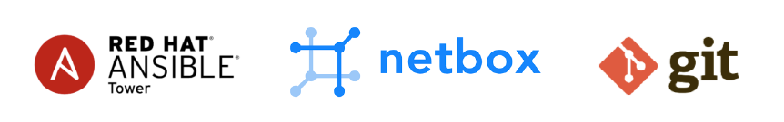

# Network Automation

## Summary

Building your own automation workflow with open source tools: Ansible, NetBox and Git.

## Your Automation Toolbox

- Microsoft VSCode Editor
- Git
- Ansible
- Python 3
- Docker Desktop

## Links

- Microsoft VSCode Editor https://code.visualstudio.com/Download
- Git https://git-scm.com/book/en/v2/Getting-Started-Installing-Git
- Ansible https://docs.ansible.com/ansible/latest/installation_guide/intro_installation.html
- Python 3 https://www.python.org/downloads/
- Docker Desktop https://www.docker.com/products/docker-desktop