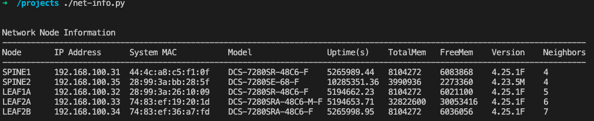

# Network Automation


## Getting Started Roadmap

Building your own automation workflow with open source tools doesn't have to be overly complicated.  Start by familiarizing yourself with these foundational elements:

- Linux
- Python
- Git

Next... setup your machine with the suggested tools below.

## Install these as part of your Automation Toolbox

- [Microsoft VSCode Editor](https://code.visualstudio.com/Download)
- [Git](https://git-scm.com/book/en/v2/Getting-Started-Installing-Git)
- [Ansible](https://docs.ansible.com/ansible/latest/installation_guide/intro_installation.html)
- [Python 3](https://www.python.org/downloads/)
- [Docker Desktop](https://www.docker.com/products/docker-desktop)

Once these tools are installed, take a look at the examples below and try them out!

First let's clone the repository from GitHub

```text
git clone https://github.com/mthiel117/webinar_feb9.git
```

## Example #1 - Python Script to gather info from Arista Network switches

Quick example of using the Arista eAPI to gather information (hostname, uptime, mac-address, lldp neighbors, etc...) from a network of switches.

**Requirements:**  Git, Python2 or Python3 (preferred) installed and Arista switches that are reachable from your workstation.  You will need to modify the IP address list of switches in the script to match your environment.

Install the JSONRPCLIB module to allow eAPI connection to be built to the switch.

If you are running python2, install **jsonrpclib** module

```text
pip install jsonrpclib
```

If running you are python3, install **jsonrpclib-pelix** module

```text
pip3 install jsonrpclib-pelix
```

In this example, we have a running lab of 5 Arista switches available to query.

```text
cd python-example
./net-info.py
```

Output should look similar to the following:



## Example #2 - Ansible Playbook to Create Base Configs from a CSV File

The following playbook creates a unique base device configuration for each row in the CSV file.

| File/Directory | Description |
| -------- | -------- |
| **./playbooks/create_base_configs.yml** | Playbook |
| **./templates/base-cfg.j2** | Jinja Template |
| **./datafiles/devices.csv** | CSV File of Device with header row (used for variable names in Jinja) |
| **./base-configs/** | Directory for rendered configuration files |

Test it out: (*requires ansible to be installed*)

```text
cd csv-playbook-example
ansible-playbook create_base_configs.yml
```

Look for config files inside the **./base-configs/** directory.
